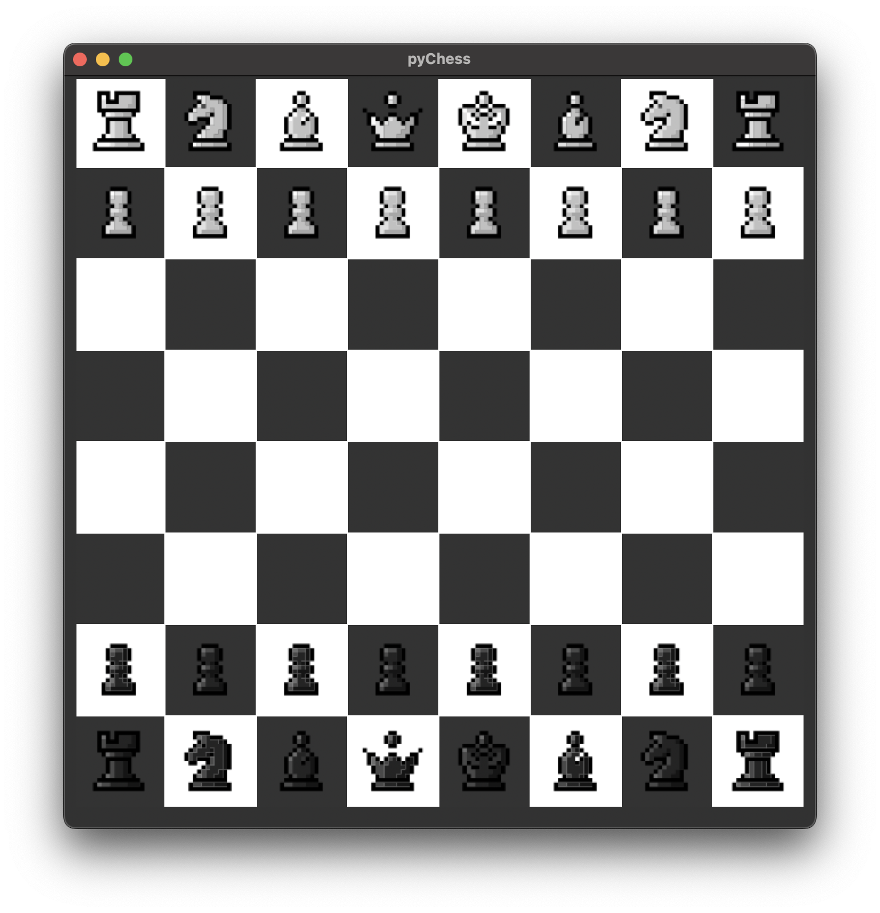

# pyChess
Chess game written in python using tkinter.

Aim functionality:
- Move pieces ✓
- reverse button
- click piece, click destination logic
- Show possible moves ✓
- remove pieces from board ✓
- start new game
- give piece back if pawn reaches end
- move order white -> black

Optional functionalities that might come
- save & load game
- Track moves
- Checkmate
- play vs AI